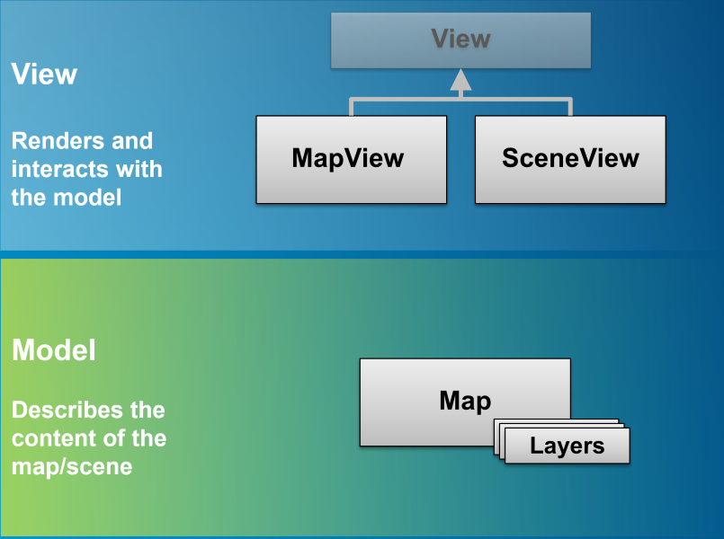

## ArcGIS API for JavaScript
Sherif Gaballah

ArcGIS API is built to be used to create 2D and 3D applications. you can easily render your `Map` in 2D by using `MapView` class or in 3D by using `SceneView` class.

# Map and View

## Map

- `Map` is a simple container that holds the layers (Operational layers or basemaps).
- one `Map` may be accessed by multiple views in the same application.
- The `Map` class contains properties and methods for storing, managing, and overlaying layers common to both 2D and 3D.
- [`Map`](https://developers.arcgis.com/javascript/latest/api-reference/esri-Map.html), [`WebMap`](https://developers.arcgis.com/javascript/latest/api-reference/esri-WebMap.html), and [`WebScene`](https://developers.arcgis.com/javascript/latest/api-reference/esri-WebScene.html) classes.

## View

- The 'View' is responsible for viewing and interacting with the components of a `Map`.
- The 'View' renders the 'Map' and its various layers, making them visible to the user.
- [`SceneView`](https://developers.arcgis.com/javascript/latest/api-reference/esri-views-SceneView.html) and [`MapView`](https://developers.arcgis.com/javascript/latest/api-reference/esri-views-MapView.html) classes.





# Layer and LayerView

## Layer
- `Layer` is a collection of spatial data in the form of vector graphics or raster images.
- `Layer` may contain discrete features that store vector data or continuous cells/pixels that store raster data.
- such as [`FeatureLayer`](https://developers.arcgis.com/javascript/latest/api-reference/esri-layers-FeatureLayer.html), [`ImageryLayer`](https://developers.arcgis.com/javascript/latest/api-reference/esri-layers-ImageryLayer.html), and [`GraphicsLayer`](https://developers.arcgis.com/javascript/latest/api-reference/esri-layers-GraphicsLayer.html).


## LayerView
- Represents the view for a single layer after it has been added to a `View`.
- Responsible for rendering a Layer's features as graphics in the `View`.
- Has a limited API.
- Notice the diffrence between [`FeatureLayer`](https://developers.arcgis.com/javascript/latest/api-reference/esri-layers-FeatureLayer.html) and it's [`LayerView`](https://developers.arcgis.com/javascript/latest/api-reference/esri-views-layers-FeatureLayerView.html).
- Give info about layer rendering.
- Give access to data displayed on the screen.
- access a `LayerView` with  [`View.whenLayerView(layer)`](https://developers.arcgis.com/javascript/latest/api-reference/esri-views-View.html#whenLayerView).
- or [`View.allLayerViews`](https://developers.arcgis.com/javascript/latest/api-reference/esri-views-View.html#allLayerViews).


---


### Getting Started in 2D

 - need a [`Map`](https://developers.arcgis.com/javascript/latest/api-reference/esri-Map.html) with data
 - and a [`MapView`](https://developers.arcgis.com/javascript/latest/api-reference/esri-views-MapView.html) with a container.

```js
const map = new Map({
  basemap: "topo"
});

const view = new MapView({
  map: map,
  container: "viewDiv"
});
```


---

### Getting Started in 3D

 - need a [`Map`](https://developers.arcgis.com/javascript/latest/api-reference/esri-Map.html) with data
 - and a [`SceneView`](https://developers.arcgis.com/javascript/latest/api-reference/esri-views-SceneView.html) with a container.

```js
const map = new Map({
  basemap: "topo"
});

const view = new SceneView({
  map: map,
  container: "viewDiv"
});
```


 
---
#### You can add the same map to multiple views and render it in 2D and 3D

``` js
const map = new Map({
  basemap: "topo"
});

const mView = new MapView({
  map: map,
  container: "viewDiv"
});
const sView = new SceneView({
  map: map,
  container: "viewDiv"
});
```